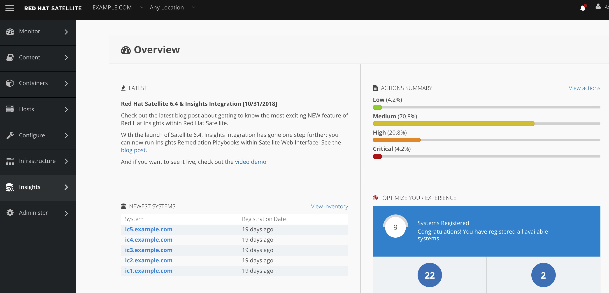
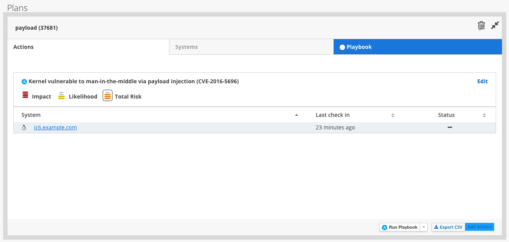
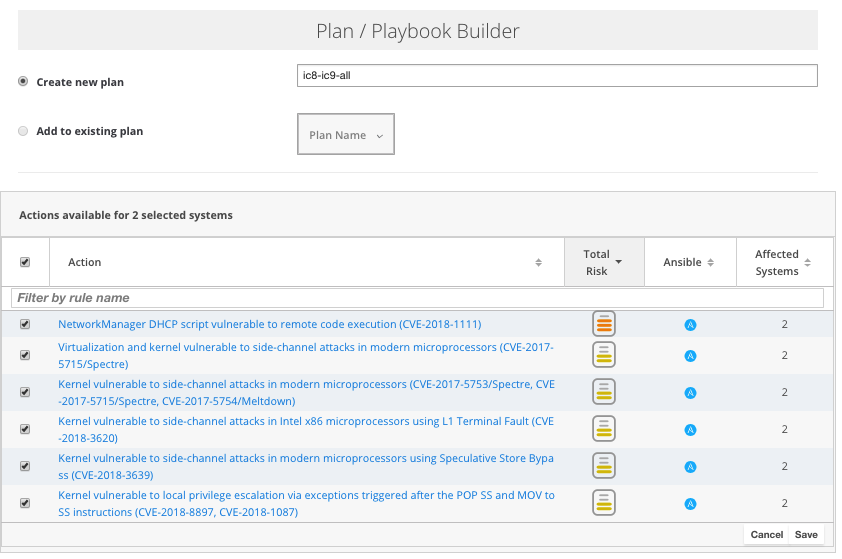

# Hands on Red Hat Management Lab
## TAM Enablement

### Amaya Rosa Gil Pippino
### Senior Technical Marketing Manganer

## README.1ST

The goal of these lab exercises are to introduce you to a variety of Red Hat products that can help you with managing and automating infrastructure resources. You will be able to demonstrate the power and flexibility of Red Hat management learning how to confgurate Red Hat Insights integrated into Red Hat Satellite and Ansible Tower by Red Hat.

Upon completion of this lab material, you should have a better understanding of how to perform management tasks in your environments, how to more securely maintain hosts, and how to achieve greater efficiencies with automating tasks and managing systems within your infrastructure, leveraging Insights capabilities.

Most of the labs are exclusive of any other lab - i.e. If you want to only perform the Satellite lab, then you can skip to the Satellite lab.  If you would like to focus on an individual lab or specific portfolio product, please use the LAB INDEX to select the Lab you would like to begin on. Step 0 should be viewed before attempting any other labs. If there is a problem with a step in your lab please raise your hand and contact one of the lab instructors.

This lab is geared towards systems administrators, cloud administrators and operators, architects, and others working on infrastructure operations interested in learning how to automate management across a heterogeneous infrastructure. The prerequisite for this lab include basic Linux skills gained from Red Hat Certified System Administrator (RHCSA) or equivalent system administration skills. Knowledge of virtualization and basic Linux scripting would also be helpful, but not required.

# Step 0: Setup & Getting Started

### Logging into all the Red Hat Products

Let’s log into the Red Hat Products that you will use in this lab so they are ready to use.

In this lab application based self-signed SSL certs are going be used, please note that they are being used and should accepted in order to complete the lab exercises.

Let’s log into the Red Hat Products that you will use in this lab so they are ready to use.

1. From the lab environment information page, copy the hostname of the Workstation system (it should be workstation-GUID.rhpds.opentlc.com where GUID matches your environment’s guid).
2. Open a terminal window on your desktop environment and make sure you can SSH into the workstation host as you see below:
3. `[lab-user@localhost ~]$ ssh lab-user@workstation-GUID.rhpds.opentlc.com`
4. **Run ‘`sudo -i`’ once you logon as lab-user to the jumpbox. This gives you root, and root has SSH keys for every host you will need to login to**.

**NOTE:**
**This step is not required**, but If you need to troubleshoot or power on/off/reboot a system, you can use the environment’s power control and consoles by clicking the link on your GUID page. The password for any consoles will be with username ‘root’ and password "**r3dh4t1!**". From this page, you will be able to access all of the Red Hat Products that you will use in this lab. Press the start button at the top right to turn on all the Red Hat Product VMs. Then, click on https for all the Red Hat Products to access the UI. For applications, You may also log into the UI of all the Red Hat Products with ‘admin’ as the Username and “****r3dh4t1!****” (without the quotes) as the Password.

The following labs take place within the fictional **EXAMPLE.COM** company.

# Lab 1: Red Hat Satellite Configuration for Integrated Insights Remediation

## Goal of Lab

In this lab, you will be provided the necessary steps and background information on how to configure Red Hat Insights to be used Red Hat Satellite for content host vulnerabilities reporting and automatic remediation. Some of the values may be pre-populated for you, and the pre-populated values may be required for subsequent labs, so **do not remove** the pre-populated values.

### Notes about Satellite Environment and Configurations

1. Each checkpoint will have a pre-built / configured object (Activation Key, Content View, Lifecycle Environment, etc.).
 
2. These pre-built objects can be used as examples as you create your own (for deeper understanding, but outside the scope of this lab).
 
3. You’ll need to name your objects differently, however configurations will need to match, so we have these here for your reference.

**NOTE on Lab Exercise Setup**: Based on the structure / mobility of the lab, it’s possible to run into some issues with certain services therein. If you run into anything, you can run the following to fully restart the satellite services.

SSH from your jumpbox as outlined in Step 0 to `root@sat.example.com` and restart katello service as follows:

~~~~
[lab-user@workstation $] sudo -i
[root@workstation #] ssh sat.example.com
[root@sat ~]# katello-service restart
~~~~

In Satellite 6.4 Insights integration has gone deeper than ever. With this new release, now Insights remediation playbooks can be executed from ***within Satellite Web Interface***. In order to do so, we simply need to be able to allow Foreman to execute commands remotely.

This plugin enables Foreman to run arbitrary commands on hosts using different providers. Initially only an SSH provider is supported but we plan to add more.
 
Communication goes through the smart proxy so Foreman does not have to have direct access to the target host and can scale to control many hosts. A command can be customized similarly to provisioning templates or partition tables. A number of templates are included for running basic commands, installing packages, etc.

**This plugin is installed in Satellite 6.4 by default.**

## Satellite server configuration

Next you have to setup ssh keys. By default smart proxy loads the key from `/usr/share/foreman-proxy/.ssh/id_rsa_foreman_proxy`. To customize it you can edit the configuration in `/etc/foreman-proxy/settings.d/remote_execution_ssh.yml`. Without customization you need to create new ssh key and distribute it to target hosts. The key **must not** use a passphrase. 

In this lab, we are not going to customize it, and use the default location.

~~~~
[root@sat]# cat /etc/foreman-proxy/settings.d/remote_execution_ssh.yml
---
:enabled: https
:ssh_identity_key_file: /var/lib/foreman-proxy/ssh/id_rsa_foreman_proxy
:local_working_dir: /var/tmp
:remote_working_dir: /var/tmp
:kerberos_auth: false
# Whether to run remote execution jobs asynchronously
:async_ssh: false
~~~~

Please note these are **NOT root's ssh keys, but specific to foreman-proxy**.

To generate a key, run the following commands on the host where Smart Proxy runs:

~~~~
[root@sat ~]# mkdir ~foreman-proxy/.ssh
[root@sat ~]# chown foreman-proxy ~foreman-proxy/.ssh
[root@sat ~]# sudo -u foreman-proxy ssh-keygen -f ~foreman-proxy/.ssh/id_rsa_foreman_proxy -N ''
~~~~

When using SELinux make sure the directory and the files have correct labels of `ssh_home_t`. If not, restore the context:

~~~~
[root@sat ~]# restorecon -RvF ~foreman-proxy/.ssh
~~~~

Don’t forget to restart Foreman, Smart Proxy and Foreman tasks so plugins are loaded:

~~~~
[root@sat ~]# service httpd restart
[root@sat ~]# service foreman-tasks restart
[root@sat ~]# service foreman-proxy restart
~~~~

Finally, you have to refresh the Smart Proxy features in the Foreman.

~~~~
[root@sat ~]# systemctl restart smart_proxy_dynflow_core
~~~~

**NOTE:** There's a known [bug](https://bugzilla.redhat.com/show_bug.cgi?id=1455822) affecting systems using directory information services, such as IdM. Basically, when executing ssh, it's executing `/usr/bin/sss_ssh_knownhostsproxy` and this does not work with users that do not have a TTY (like the case of `foreman-proxy`). The workaround to solve this its commenting the following lines in `/etc/ssh/ssh_config` :

~~~~
#ProxyCommand /usr/bin/sss_ssh_knownhostsproxy -p %p %h
#       GSSAPIAuthentication yes
## If this option is set to yes then remote X11 clients will have full access
## to the original X11 display. As virtually no X11 client supports the untrusted
## mode correctly we set this to yes.
#       ForwardX11Trusted yes
## Send locale-related environment variables
#       SendEnv LANG LC_CTYPE LC_NUMERIC LC_TIME LC_COLLATE LC_MONETARY LC_MESSAGES
#       SendEnv LC_PAPER LC_NAME LC_ADDRESS LC_TELEPHONE LC_MEASUREMENT
#       SendEnv LC_IDENTIFICATION LC_ALL LANGUAGE
#       SendEnv XMODIFIER
~~~~

## Remote Hosts Configuration

The remote hosts need to be configured to accept the private key that the smart proxy is using. root is used as the default user for accessing remote hosts via SSH. You may set the `remote_execution_ssh_user` global setting to change the default. If you would like to override at the host group, host, or other level, you may use parameters to do so. Set a parameter called `remote_execution_ssh_user`.

The ssh keys for the smart proxies are available as a host parameter  (`remote_execution_ssh_keys`). This allows you to manage the authorized keys with your configuration management platform of choice, or through a provisioning template.

~~~~
[root@sat ~]# ssh-copy-id -i ssh/id_rsa_foreman_proxy.pub root@ic1.example.com
~~~~

**NOTE:** This step has to be repeated for all the icX client machines.

# Lab 2: Proactive Security and Automated Risk Management with Red Hat Insights

## Goal of Lab

The goal of this lab is to introduce you to the proactive security capabilities of Red Hat Insights. This lab assumes the following:

*   You started all your VMs, per the instructions in Step 0.
*   Did not delete any of the key items in the pre-populated Satellite 6 configuration, which are necessary for Insights to work properly.

## Introduction

Red Hat Insights was designed to proactively evaluate the security, performance, and stability of your Red Hat platforms by providing prescriptive analytics of your systems. Insights helps move you from reactive to proactive systems management, delivers actionable intelligence, and increases visibility of infrastructure risks and the latest security threats. Operational analytics from Insights empowers you to prevent downtime and avoid firefighting, while also responding faster to new risks.

In this lab, we will focus only on the specific security features of Red Hat Insights.

Red Hat Insights recommendations are tailored for the individual system where risk is detected. This allows you to be certain that actions identified by Insights are validated and have a verified resolution for each detected risk, reducing false positives you may experience from critical risks identified by third-party security scanners. Insights provides predictive analysis of security risk in your infrastructure based on a constantly evolving threat feed from Red Hat.

Through analysis of Insights metadata and curated knowledge based on over fifteen years of enterprise customer support, Red Hat is able to identify critical security vulnerabilities, statistically frequented risks, and known bad configurations. We scale this knowledge to our customers with Insights reporting and alerts, allowing prediction of what will happen on a monitored system, why it will happen, and how to fix a problem before it can occur.

Red Hat Insights functionality is integrated into Red Hat’s Customer Portal, Satellite, and Ansible Tower by Red Hat. Recommendations from Insights are human-readable and in most cases can simply be copy and pasted into the terminal to resolve the issue. You may also automate remediation of hosts in your infrastructure with Insights generated Ansible playbooks, Ansible Tower integration or even Satellite inegration (6.4 required). 

## Cleaning your environment

The following are the steps needed to get your Red Hat Insights managed hosts registered to Red Hat Satellite. You’ll need to register them to your company’s new Satellite, using the provided bootstrap script to quickly and easily begin managing them, and fix some of the critical vulnerabilities with these systems. In a real-world-scenario, Insights can be installed automatically by Satellite upon provisioning or registration of a new system to the Satellite, which means you do not have to manually login and register each host. These steps can be easily automated with Ansible or a shell script, but for sake of completion we will perform them manually in these labs with only a few systems.

To login to your client VM, first SSH into your workstation node at `workstation-<GUID>.rhpds.opentlc.com` as lab-user. An ssh key is already in the home directory of your laptop, which should allow you to login without a password. Should a password be required, use **r3dh4t1!** as your password.

~~~~
[lab-user@localhost ~]$ ssh workstation-GUID.rhpds.opentlc.com
[lab-user@workstation-GUID ~]$ sudo -i
~~~~

From it, jump into every single one of the insights client machines (from ic1.example.com to ic9.example.com), also using ssh (ssh passwordless has already been configured for your convenience):

~~~~
[root@workstation ~]#ssh ic5.example.com
~~~~

**NOTE**: Due to the configuration of the account used for this lab (it’s shared amongst the different instances) the clean up of the hosts in Satellite is required. However, on the Tower box, there is a playbook that basically does all what’s explained below, but for the sake of understanding, steps are also deatiled here.

If you want to use it, from the jumpbox machine, jump to the tower one and execute the following playbook:

~~~~
[root@workstation ~]# ssh tower
[root@tower ~]# cd playbooks/
[root@tower playbooks]# ansible-playbook canned-demo.yml
~~~~

What this playbook does, is cleaning Satellite configuration, assuring machines are registered to both Insights and Satellite and then, making sure there’s something to be fixed. You can just skip the following steps until "`Fixing the payload injection security issue`"

Make sure old satellite info is removed:

~~~~
[root@icX ~]# yum clean all ; rm -rf /var/cache/yum/*
[root@icX ~]# subscription-manager clean
[root@icX ~]# rm -fv /etc/rhsm/ca/katello*
[root@icX ~]# rm -fv /etc/rhsm/facts/katello*
[root@icX ~]# rm -rfv /var/lib/puppet
[root@icX ~]# yum remove -y katello-ca-consumer*
~~~~

### Adding your Insights hosts to Satellite

From there, this is your "jumpbox" that will allow you to access each of the client machines (ic1.example.com through ic9.example.com), also using ssh (ssh passwordless has already been configured for your convenience). The following are the commands used.

Pull down new bootstrap script from new Satellite 6 server:

~~~~
[root@icX ~]# curl https://sat.example.com/pub/bootstrap.py > bootstrap.py --insecure
[root@icX ~]# chmod +x bootstrap.py
~~~~

Run the bootstrap.py script using the Satellite manifest that uses certificate based authorization in order to register your machines with Satellite as follows (provide the password when required):

~~~~
[root@icX ~]# ./bootstrap.py -l admin -s sat.example.com -o 'EXAMPLE.COM' -L 'Default Location' -g rhel7 -a rhel7
~~~~

Please note, that this step has to be performed in **all icX** client machines.

In addition, manual installation and registration of the Insights client is also possible by performing the following (just in case bootstrap script fails or when performing this without a Satellite server).

To install Insights RPM in each of your systems issue the following command:

~~~~
[root@icX ~]# yum -y install insights-client
~~~~

And then, simply register each machine with Red Hat Insights as follows:

~~~~
[root@icX ~]# insights-client --register
~~~~

NOTE: On RHEL 7.5 client RPM has been renamed to insights-client, but this demo machines are using RHEL 7.0 and 7.3 for demonstration purposes, so the package name is still the old one.

And repeat the steps. If no errors, proceed to the next section, If there was an error see below:

NOTE: If bootstrap.py fails with this error:

~~~~
[RUNNING], [2018-04-19 06:28:43], [Calling Foreman API to create a host entry associated with the group & org]
An error occurred: HTTP Error 422: Unprocessable Entity
url: https://sat.example.com:443/api/v2/hosts/
code: 422
[...]
"full_messages": "Name has already been taken"
[...]
Output truncated
~~~~

It means machines have already been registered using subscription manager, in that case, you just have to delete the hosts from the Satellite UI and re-run bootstrap. See the below graphics. If your hosts were successful, continue past these screenshots.

In your Firefox web browser, click on the tab you have opened to your Red Hat Satellite 6.4 UI. Log back in with **admin** as the username and **r3dh4t1!** as your password.

Go to Hosts → All Hosts and you will see them listed as follows:

Select the ic[1-9].example.com hosts and delete them by going to

Select Action → Delete Hosts, as in the following screen.

Then, run the bootstrap.py script again.

When logging into the Satellite UI you should see your systems registered. Go to Hosts → Content Hosts and you will see them listed as follows:

### Installing the Insights client

Now it’s the time to install the Insights RPM and register your system to Red Hat Insights.

bootstrap.py should have taken care of this for you. If your lab is setup natively to the environment, if you changed some settings this may not happen automatically, so to check navigate to Insights → Overview.

If the systems are not showing up as registered, proceed with installing the RPMs on each host.

To install Insights RPM in each of your systems issue the following command:

~~~~
[root@ic5 ~]# yum -y install insights-client
~~~~

And then, simply register each machine with Red Hat Insights as follows:

~~~~
[root@ic5 ~]# insights-client --register
Automatic daily scheduling for Insights has been enabled.
Starting to collect Insights data
Uploading Insights data, this may take a few minutes
Upload completed successfully!
~~~~

## Fixing the payload injection security issue in your system using Red Hat Insights from the Satellite UI

You’d need to login to your client VM, first SSH into your workstation node at workstation-*GUID*.rhpds.opentlc.com as lab-user, the sudo to root. Should a password be required, use "**r3dh4t1!**" as your password. 

~~~~
[lab-user@localhost ~]$ ssh lab-user@workstation-GUID.rhpds.opentlc.com
[lab-user@workstation-GUID ~]$ sudo -i
~~~~
 
### Fixing the payload injection security issue

Now, going back to the Satellite UI, click on Red Hat Insights → Overview, where you should see all your registered systems, actions summary (highlighted by priority) as well as latest updates from Red Hat. 

In this lab, we will fix the specific `Kernel vulnerable to man-in-the-middle via payload injection (CVE-2016-5696)` on your client VMs without causing downtime. 

###STEPS:

1. From your Satellite 6.4 UI, click on Insights → Inventory.

2. Click on your client VM, which is ic6.example.com. You will see the list of issues affecting it when clicking on the system name.

3. Notice that your system shows up with multiple security vulnerabilities.

Note: Our objective is to fix the payload injection problem without causing downtime *from the Satellite Web Interface*, and see that it no longer appears as a vulnerability in Insights / Satellite. Specifically, this payload injection problem causes the kernel to be vulnerable to man-in-the-middle via payload injection. A flaw was found in the implementation of the Linux kernel's handling of networking challenge ack ([RFC 5961](https://tools.ietf.org/html/rfc5961&sa=D&ust=1540798655190000)) where an attacker is able to determine the shared counter. This flaw allows an attacker located on different subnet to inject or take over a TCP connection between a server and client without needing to use a traditional man-in-the-middle (MITM) attack.

Use your browser’s search function to search for “payload injection”. 

Note: Reading the description for the vulnerability shows that the `sysctl` variable is set to a level that allows being exploited. We want to do the active mitigation by changing the `sysctl` variable and making it permanent on reboot. In this case, we do not want to update the kernel or reboot since we don’t want downtime.

4. From your Satellite 6.4 UI Go to the Planner screen, click on Insights → Planner.

Name your plan payload and select system ic6.example.com and select the issue to fix, `Kernel vulnerable to man-in-the-middle via payload injection (CVE-2016-5696)` and click "save".

There are two ways to solve this issue, one is by updating the kernel, and the other one is apply the needed changes to the `/etc/sysctl.conf` file to add the mitigation configuration, and reload the kernel configuration.

Insights gives us the opportunity to choose the resolution that we want. Please make sure to select “Set sysctl ip4 challenge ack limit” as your preferred choice and then click on the Save button.

Once the plan is saved, the planner screen is shown where you can see the newly created plan, as well as the issues it resolves and the systems affected.

Please notice the new dropdown box on the bottom of the screen. Now, you can either choose to Run Playbook (to solve issues now from Satellite), Customize Playbook Run (to schedule when Satellite is to execute it) or Download Playbook (for later manuall run).

In this first lab, we are going to choose Run Playbook, the following screen appears:

After a little while, the execution of the playbook should succeed, and the success screen should appear:

Now, if you go back to Insights → Inventory you should be seeing that ic6.example.com has been recently updated (not like the rest of the hosts) and that it has one issue less (if you click on it, you shouldn't be seeing the `Kernel vulnerable to man-in-the-middle via payload injection (CVE-2016-5696)` any more).

### Automatically fixing the payload injection security issue via Ansible Playbook

It is also possible to automate some of the issues with an Ansible Playbook that Insights provides us. You can see that in the top left corner of every single issue with the Ansible logo in blue if a playbook is available, or in grey if it’s not. You may want to add the remediation steps to your regular manteinance playbooks, so let's download it and apply it manually.

Let's solve the same issue in host ic5.example.com.

As before, we simply need to create a plan.

1. From your Satellite 6.4 UI, click on Insights → Inventory.

2. Click on your client VM, which is ic5.example.com. You will see the list of issues affecting it when clicking on the system name.

3. Notice that your system shows up with multiple security vulnerabilities (you can look for payload and you'll find the one we are to resolve).

Now we need to create a plan in which the issues that are found will be solved using an Ansible Playbook. In order to do so, from your Satellite 6.4 UI, click on Insights → Planner.

And once there, let's gonna add this system (ic5.example.com) to the previously created plan, payload.

Select the payload plan and once there, click on Actions Edit, and select ic5.example.com:

As seen in the previous part of this laboratory, there are two ways to solve this issue, one is by updating the kernel, and the other one is apply the needed changes to the /etc/sysctl.conf file to add the mitigation configuration, and reload the kernel configuration, this is the way we are going to solve the issue, as this is the way we choose it in the previous part of the lab.

You should now download the playbook by selecting the dropdown, however, it’s been already downloaded for your convenience to the sat machine, as now, with the Ansible integration, you don't need a tower machine to execute playbooks.

If not already there, login to your client VM, first SSH into your workstation node at workstation-*<GUID>*.rhpds.opentlc.com as the lab-user. An ssh key is already in the home directory of your laptop, which should allow you to login without a password. Should a password be required, use “**r3dh4t1!**” as your password.

~~~~
[lab-user@localhost ~]$ ssh workstation-GUID.rhpds.opentlc.com
[lab-user@workstation-GUID ~]$ sudo -i
~~~~

Now that you are in the workstation node, SSH into the tower machine in order perform the recommended active mitigation with the Ansible Playbook.

~~~~
[root@workstation ~]# ssh sat
~~~~

Inspect the Ansible Playbook that Insights has created automatically for you:

~~~~
[root@sat ~]# vi payload-injection.yml
~~~~

Now, simply proceed to remediate the payload injection security issue by executing the Ansible Playbook as follows:

~~~~
[root@sat ~]# ansible-playbook payload-injection.yml
PLAY [Set sysctl ipv4 challenge ack limit] *************************************************************

TASK [Gathering Facts] *********************************************************************************
ok: [ic5.example.com]
ok: [ic6.example.com]

TASK [set the sysctl net.ipv4.tcp_challenge_ack_limit = 2147483647] ************************************
ok: [ic6.example.com]
changed: [ic5.example.com]

PLAY [run insights] ************************************************************************************

TASK [run insights] ************************************************************************************
ok: [ic6.example.com]
ok: [ic5.example.com]

PLAY RECAP ************************************************************************************
ic5.example.com            : ok=3    changed=1    unreachable=0    failed=0
ic6.example.com            : ok=3    changed=0    unreachable=0    failed=0
~~~~

Please note that when the execution is completed, the Insights agent is also run, so the latest state of the system is reporting into Insights automatically. Also note that ic6.example.com has not been updated (task only reports changed on ic5) as the issue has already been fixed.

Now from the Satellite UI, click on Insights → Inventory you will notice that system ic5.example.comhas one less issue, just like ic6.example.com and that both have just been reporting into Insights.

## Manually Fixing the payload injection security issue in your system using Red Hat Insights

Now, let's think for a moment that you don't want to remediate from Satellite UI immediately the issue, instead, you want to apply it manually and follow the recommended steps.

If not already there, login to your client VM, first SSH into your workstation node at `workstation-<GUID>.rhpds.opentlc.com` as lab-user. An ssh key is already in the home directory of your laptop, which should allow you to login without a password. Should a password be required, use “**r3dh4t1!**” as your password.

~~~~
[lab-user@localhost ~]$ ssh workstation-GUID.rhpds.opentlc.com
[lab-user@workstation-GUID ~]$ sudo -i
~~~~

Now that you are in the workstation node, SSH into your RHEL7 client/host.

~~~~
[root@workstation ~]# ssh ic7
~~~~

Now, as root, perform the recommended active mitigation. Edit the `/etc/sysctl.conf` file to add the mitigation configuration, and reload the kernel configuration:

~~~~
[root@ic7 ~]# echo "net.ipv4.tcp_challenge_ack_limit = 2147483647" >> /etc/sysctl.conf
[root@ic7 ~]# sysctl -p
net.ipv4.tcp_challenge_ack_limit = 100
vm.legacy_va_layout = 0
net.ipv4.tcp_challenge_ack_limit = 2147483647
~~~~

After applying the active mitigation, we want to have the system report any changes, run the following command as root on ic7.example.com:

~~~~
[root@ic7 ~]# insights-client
Starting to collect Insights data
Uploading Insights data, this may take a few minutes
Upload completed successfully!
~~~~

Wait until this step completes before moving to the next step.

1. From your Satellite 6.4 UI, click on Red Hat Insights → Inventory.

2. Click on your client VM, which is ic7.example.com. You will notice than the number of actions has decreased and that it has reported into Insights recently too.

3. Use your browser’s search function to search for “payload injection”. You will notice that this payload injection issue is no longer listed due to fixing the vulnerability.

Congratulations, you’re no longer vulnerable to the payload injection vulnerability!

### Bonus! Automatically fix all the issues on systems ic8.example.com and ic9.example.com that have playbooks

From the Satellite UI, click on Insights → Inventory so we can focus on systems ic8.example.com and ic9.example.com, please notice the number of action actions each one has, as they are to be solved.

In the inventory screen, select both systems and click on Actions, on the top left corner, and then select Create a new Plan / Playbook.

This way, we are going to create an Ansible Playbook-based plan to solve issues on those two specific systems (systems can also be grouped as per our convenience, from that very same menu). We are going to solve all the issues again, from the Satelleite Web Interface.

The Plan / Playbook Builder screens appears. Please make sure to fill the boxes as follows:

Plan name: ic8-ic9-all

Actions: all (do this by clicking on the box by the Action label at the top).

Your screen should look like:

Then click on the Save button in the bottom right corner.

As before, you are given the option to choose between different ways to solve your issues. In this lab, we’ve chosen to go for the ones that do not require a reboot, in order to save some time.

The plan description screen appears.

You should see all the issues this plan is going to solve as well as the affected systems.

Scrolling down the screen, you should be able to run the playbook. 

Like in the previous exercise, the exectuting playbook screen appears. You can click on the top right corner "Job Task" button to inspect the execution of the playbook (please note, this step takes some time, so feel free to play around).

After the exectution is completed, you should be seeing the success execution screen:

Please note that when the execution is completed (this may take a while), the Insights agent is also run, so the latest state of the system is reporting into Insights automatically.

Note that some of the issues won’t be able to be solved by the ansible playbook and you’d need to do some extra steps.

Now from the Satellite UI, click on Red Hat Insights → Inventory you will notice that your systems have few issues.

# Lab 3: Automatic Remediation with Red Hat Insights and Ansible Tower

## Goal of Lab

The goal of this lab is to introduce you to the proactive security capabilities of Red Hat Insights and automatic remediation with Ansible Tower. This lab assumes that you started all your VMs, as instructed in Step 0, which is necessary for Red Hat Insights to work properly.  This will also be your first use of Tower in this lab if you are doing the labs sequentially. You should require no prior Tower knowledge to follow all instructions.

## Introduction

Red Hat Insights was designed to proactively evaluate the security, performance, and stability of your Red Hat platforms by providing prescriptive analytics of your systems. Red Hat Insights helps move you from reactive to proactive systems management, delivers actionable intelligence, and increases visibility of infrastructure risks and the latest security threats. Operational analytics from Red Hat Insights empowers you to prevent downtime and avoid firefighting while responding faster to new risks.

### Setting up an Insights Scan Project

Tower supports integration with Red Hat Insights. Once a host is registered with Insights, it will be continually scanned for vulnerabilities and known configuration conflicts. Each of the found problems may have an associated fix in the form of an Ansible playbook. Insights users create a maintenance plan to group the fixes and, ultimately, create a playbook to mitigate the problems. Tower tracks the maintenance plan playbooks via an Insights project in Tower. Authentication to Insights via Basic Auth, from Tower, is backed by a special Insights Credential, which must first be established in Tower. To ultimately run an Insights Maintenance Plan in Tower, you need an Insights project, an inventory, and a Scan Job template.

### Create Insights Credentials

If not already there, login to your client VM, first SSH into your workstation node at `workstation-<GUID>.rhpds.opentlc.com` as the lab-user. An ssh key is already in the home directory of your laptop, which should allow you to login without a password. Should a password be required, use “**r3dh4t1!**”  as  your password.

~~~~
[lab-user@localhost ~]$ ssh workstation-GUID.rhpds.opentlc.com
[lab-user@workstation-GUID ~]$ sudo -i
~~~~

In your Firefox web browser, click on the tab you have opened to your Red Hat Ansible Tower UI. Log back in with adminas the username and **r3dh4t1!** as your password.

Credentials have already been provided for your convenience.

### Creating an inventory

The Insights playbook contains a hosts: line where the value is the hostname that Insights itself knows about, which may be different than the hostname that Tower knows about. Therefore, make sure that the hostnames in the Tower inventory match up with the system in the Red Hat Insights Portal.

For your convenience, the Insights inventory has been already created for you.

Please note that typically, your inventory already contains Insights hosts. Tower just doesn’t know about them yet. The Insights credential allows Tower to get information from Insights about an Insights host. Tower identifying a host as an Insights host can occur without an Insights credential with the help of scan facts.yml file.

In order for Tower to utilize Insights Maintenance Plans, it must have visibility to them. Create and run a scan job against the inventory using a stock manual scan playbook (this is provided by Red Hat to its customers).

### Creating a Scan Project

1.  Click the Projects main link to access the Projects page.
2.  Click the button, which launches the New Project window.
3.  Enter the appropriate details into the required fields, at minimum. Note the following fields requiring specific Insights-related entries:

*   Name: Insights Scan Summit
*   Organization:         Red Hat's Management BU Example.com
*   SCM Type: Select Git.
*   Upon selecting the SCM type, the Source Details field expands.

4. In the SCM URLfield, enter https://github.com/ansible/awx-facts-playbooks. This is the location where the scan job template is stored.
5. Click Save when done.

Your screen should look as the following:

All SCM/Project syncs occur automatically the first time you save a new project. However, if you want them to be updated to what is current in Insights, manually update the SCM-based project by clicking the  button under the project’s available Actions.

Syncing imports into Tower any Maintenance Plans in your Insights account that has a playbook solution. It will use the default Plan resolution. Notice that the status dot beside the name of the project updates once the sync has run.

Now it’s the time to put all the pieces together, by using a job template that uses the fact scan playbook.

### Creating a Job Template

1.  Click the Templates main link to access the Templates page.
2.  Click the  button and select Job Template, which launches the New Job Template window.
3.  Enter the appropriate details into the required fields, at minimum. Note the following fields requiring specific Insights-related entries:

*   Name: Insights Scan Summit
*   Job Type: Choose Run from the drop-down menu list.
*   Inventory: Example.com Satellite Inventory
*   Project: Enter the name of the Scan project you previously created, Insights Scan Summit.
*   Playbook: Select scan_facts.yml from the drop-down menu list. This is the playbook associated with the Scan project you previously set up.
*   Credential: Example.com SSH Password. The credential does not have to be an Insights credential, but machine (also created for your convenience).
*   Click to select Use Fact Cache from the Options field.

4.  Click Save when done.

Your screen should look as follows:

Click the  icon to launch the scan job template, the output you should see is something like this, if it all went as expected:

With this, we know the state our machines are in and issues they may have that should be remediated. This is what we are going to do in the next part of the lab.

Now, we can see Insights data from the Ansible Tower UI.

### Viewing Insights data into Tower

1.  Click the Inventories main link to access the Inventories page.
2.  In the list of inventories, click to open the details of your Insights inventory.

3.  Click the Hosts tab to access the Insights hosts that have been loaded from the scan process.
4.  Click to open one of the hosts that was loaded from Insights (ic6.example.com, for instance).

Notice the Insights tab is now shown on Hosts page. This indicates that Insights and Tower have reconciled the inventories and is now set up for one-click Insights playbook runs. Click on it.

You now can see a list of issues Insights has identified and whether or not the issues can be resolved with a playbook is also shown.

## BONUS!

## Automatically remediate Insights Inventory

### Creating a Remediation Project

Remediation of an Insights inventory allows Tower to run Insights playbooks with a single click, instead of using the CLI as we did in the previous Lab.

First thing is to create a remediation project, similar to the scan project previously created.

1.  Click the Projects main link to access the Projects page.
2.  Click the  button, which launches the New Project window.

3.  Enter the appropriate details into the required fields, at minimum. Note the following fields requiring specific Insights-related entries:

*   Name: Insights Remediation Summit
*   Organization: Red Hat's Management BU Example.com, or click the  button and select it from the pop-up window.
*   SCM Type: Select Manual.
*   Playbook: Select insights remediation summit
*   Project Base Path: /var/lib/awx/projects (automatically populated).

4.  Click on Save

Your screen should look as follows:

NOTE: In the real world, we would be accessing directly to our Red Hat account, however for the limitations of the configuration in this lab, this is not possible. In the real world, we’d need to choose Red Hat Insights as the SCM type and our Customer Portal Credentials (later in this lab we’d need to use them, and they have already been created for your convenience).

In the real world, you should be seeing something like the following screen:

### Creating a Remediation Job Template

Similar to the one created before, we are to create a remediation job template that can use the remediation project we have just created.

1.  Click the Templates main link to access the Projects page.
2.  Click the  button and select Job Template, which launches the New Job Template window.
3.  Enter the appropriate details into the required fields, at minimum. Note the following fields requiring specific Insights-related entries:

*   Name: Insights Remediation Summit.
*   Job Type: Choose Run from the drop-down menu list.
*   Inventory: Example.com Satellite Inventory
*   Project: Enter the name of the project you previously created, Insights Remediation Summit.
*   Playbook: Select summit.yml from the drop-down menu list. This is the playbook associated with the Remediation project you previously set up.
*   Credential: Example.com SSH Password. The credential does not have to be an Insights credential, but machine (also created for your convenience).

4.  Click Save when done.

Your screen should look as follows:

Now, simply execute it by clicking on the rocket next to the name of the template in the templates list down the screen.

The playbook execution screen appears and shows you the result.

Note: There is a known race condition where when executing the playbook it will fail on the first run for some older RHEL 7.0 hosts. Simply re-run the playbook and everything should complete successfully, and the hosts that failed the first time will complete remediation.
